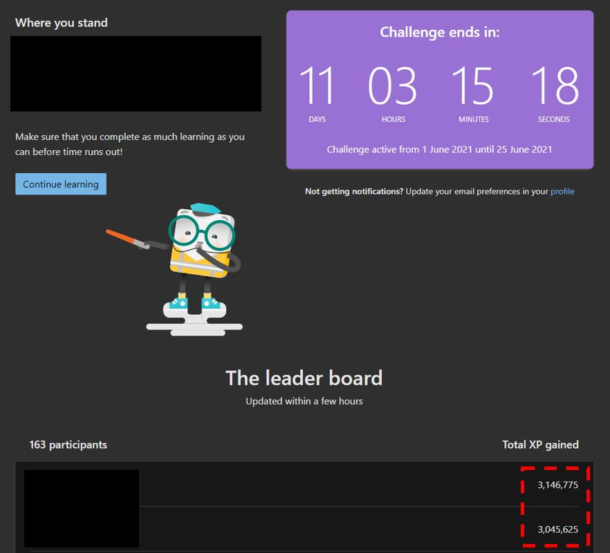
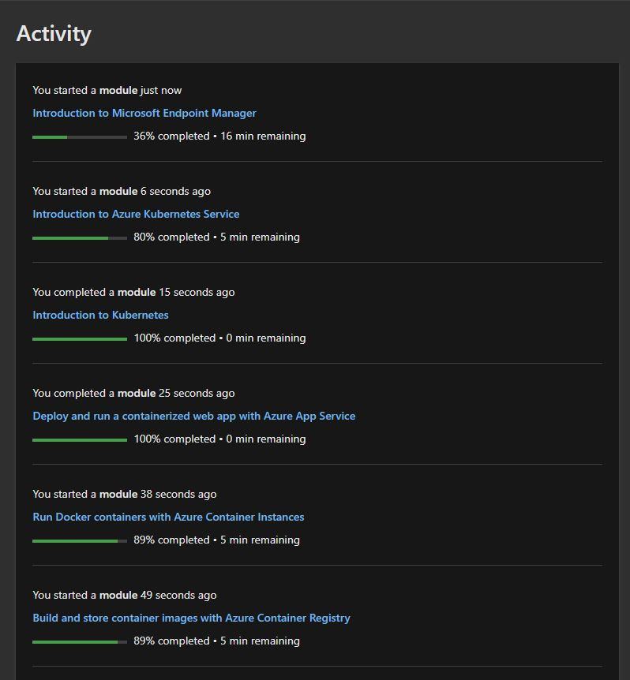
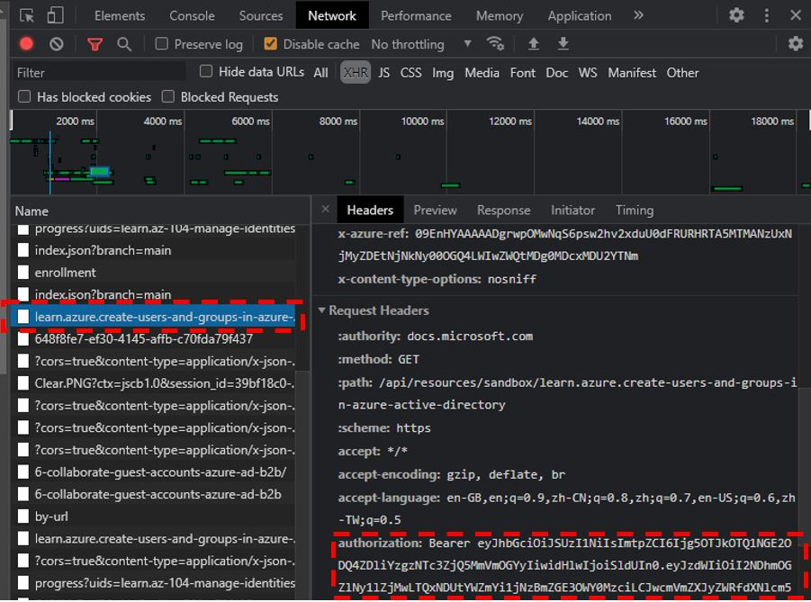

# How to max your score on Microsoft Learn
Wonder how others are able to compelte their Microsoft Cloud Challenge so quickly? Getting as high as 3,000,000 XP in a matter of weeks?




Here is the answer.

Look at how quickly courses are completed.



Steps:
1) Get a list of microsoft learn content by running `node getList.js`
2) Filter the list to get all `LearningPath` in Microsoft Learn by running `node filterList.js`
3) Obtain and Compile the list of `unit` for all `module` under all `LearningPath` by running `node getUnit.js`
4) Find your `authorization token` and replace `token` variable inside `completeUnit.js`. Then run `completeUnit.js`.

## Getting your authorization token


To obtain your token, simply go to a `unit` in Microsoft Learn (for example: https://docs.microsoft.com/en-us/learn/modules/create-users-and-groups-in-azure-active-directory/2-user-accounts-azure-ad)

Then simply look for the `authorization` header in the `Request Headers`.

You can also try to get it from `Microsoft Graph API`.

## Terminologies:
### Unit
> Smallest unit in Microsoft Learn

### Module
> A module comprises of multiple unit

### Learning Path
> A learning path comprises of multiple Module

## Caveat:
To avoid getting rate-limited, a `delay` is needed between call for completing a `unit`. Here, a 1000ms delay is adopted. Feel free to edit the delay in `completeUnit.js`

There are 3 possible response from Microsoft Learn when trying to complete the `unit`


1) The `unit` is completed successfully
```JSON
// Case 1 Response
{
  "updated":true,
  "passed":true,
  "achievements":[
    {
      "uid":"learn.wwl.configure-sql-server-resources-for-optimal-performance.control",
      "type":"unit",
      "points":[
        {
          "value": 100,
          "reasonId": "points.unit.basic.completed"
        }
      ]
    }
  ]
}
```

2) The `unit` had been completed prior to this exercise
```JSON
// Case 2 Response
{
  "updated":false,
  "passed":true
}

```

3) The `unit` have a `knowledge check` section that requires answer in the following format
```JSON
// Case 3 Response
{
  "ErrorMessage":"missing payload.",
  "ErrorCode":"BodyNotRecognized",
  "HttpStatusCode":400,
  "Retriable":false
}
```

```JSON
// Request body required to complete `knowledge check`
[
  {
    "id":"0",
    "answers":[
      "2"
    ]
  },
  {
    "id":"1",
    "answers":[
      "1"
    ]
  }
]
```


## API Used
Get the entire catalog of microsoft learn content
`https://docs.microsoft.com/api/learn/catalog`
> Method: `GET`
>
> Sample Output: `list.json`

<br>

Get the associated information with regards to a learning path
`https://docs.microsoft.com/api/hierarchy/paths/${LearningPath}`
> Method: `GET`
>
> Sample Output: `path.json`
Here we're only interested with the 

<br>

Complete the Unit
`https://docs.microsoft.com/api/progress/units/${Unit}`
> Method: `PUT`
> Bearer Authentication required in the header.


## Disclaimer
> Do not do this. This is just an exploratory mission to understand how broken the cloud challenge.


